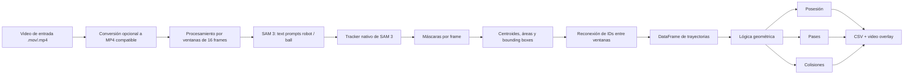

# 🏆 Copa FutBotMX – Capítulo Visión por Computadora
## Los Series de Tiempo – Detección Geométrica de Eventos con SAM 3

Este repositorio contiene la solución desarrollada por **Los Series de Tiempo** para la **Copa FutBotMX – Capítulo Visión por Computadora**. Nuestro pipeline utiliza **SAM 3 (Segment Anything Model 3)** de Meta en configuración base, sin fine-tuning, para segmentar, rastrear y analizar videos de fútbol robótico.  

La solución está diseñada para identificar robots y balón, extraer centroides por frame y detectar eventos relevantes mediante lógica geométrica: **posesión**, **pases exitosos** y **colisiones**.

---

## 📖 1. Descripción del Enfoque

Nuestra solución procesa videos de partidos de fútbol robótico y convierte la salida visual en datos estructurados para análisis de juego.

El enfoque se divide en cuatro etapas principales:

1. **Segmentación inicial con SAM 3**  
   Se utiliza SAM 3 con prompts de texto para detectar objetos relevantes:
   - `robot`
   - `ball` / `soccer ball`

2. **Rastreo con el tracker nativo de SAM 3**  
   A partir de los prompts iniciales, SAM 3 propaga las máscaras a lo largo del video. Para evitar sobrecargar memoria, el video se procesa por ventanas físicas cortas.

3. **Extracción de centroides**  
   Por cada máscara detectada se calcula:
   - centroide `(x, y)`;
   - área de la máscara;
   - bounding box;
   - frame;
   - ID local de SAM 3;
   - ID global reconectado entre ventanas.

4. **Lógica geométrica de eventos**  
   Con las trayectorias de robots y balón se calculan distancias euclidianas y velocidades para detectar:
   - posesión del balón;
   - pases exitosos;
   - colisiones entre robots.

---

## 🧠 2. Arquitectura de la Solución



### 2.1 Uso de SAM 3

- **Modelo utilizado**: SAM 3 base.
- **Modo de uso**: zero-shot / sin fine-tuning.
- **Prompts principales**:
  - `small robot`
  - `ball`
  - `small orange ball`
- **Prompts alternativos probados**:
  - cajas delimitadoras exportadas desde Roboflow como fallback experimental.
- **Estrategia final**: prompts de texto, ya que fueron suficientes para detectar los objetos clave.

### 2.2 Estrategia de memoria

SAM 3 carga todos los frames del recurso recibido en `start_session`. Por ello, para analizar videos completos sin reiniciar el runtime, la solución no pasa el video completo directamente al modelo. En su lugar:

1. Se divide el video en clips físicos de 16 frames;
2. Se ejecuta SAM 3 sobre cada clip;
3. Se guardan resultados parciales;
4. Se libera memoria GPU/CPU;
5. Se unen los resultados al final.

Esta estrategia permite procesar videos largos en entornos como **Google Colab con GPU T4**.

### 2.3 Lógica geométrica

#### Distancia euclidiana

Para medir la separación entre el balón y cada robot se usa:

```text
d = sqrt((x_robot - x_balon)^2 + (y_robot - y_balon)^2)
```

#### Posesión

Un robot tiene posesión si:

```text
distancia(robot, balón) <= POSSESSION_DISTANCE_PX
```

Valor inicial usado:

```python
POSSESSION_DISTANCE_PX = 20.0
```

#### Pase exitoso

Se registra un pase si:

```text
Robot A tiene posesión
→ el balón queda libre y rápido
→ Robot B adquiere posesión dentro de una ventana temporal
```

Parámetros iniciales:

```python
BALL_FREE_DISTANCE_PX = 28.0
BALL_FAST_SPEED_PX_PER_FRAME = 6.0
PASS_WINDOW_FRAMES = 30
PASS_MIN_FREE_FRAMES = 2
```

#### Colisión

Se registra una colisión si:

```text
distancia(robot A, robot B) <= COLLISION_DISTANCE_PX
```

y además se cumple al menos una condición dinámica:

```text
velocidad relativa alta
o
ángulo de cruce alto
```

Parámetros iniciales:

```python
COLLISION_DISTANCE_PX = 45.0
COLLISION_REL_SPEED_PX_PER_FRAME = 3.0
COLLISION_MIN_CROSSING_ANGLE_DEG = 60.0
```

---

## 💻 3. Requisitos de Hardware y Software

### 3.1 Hardware recomendado

- **GPU recomendada**: NVIDIA T4, RTX 3060 o superior.
- **VRAM recomendada**: mínimo 12 GB; probado con ~16 GB en Google Colab T4.
- **CPU/RAM**: 12 GB de RAM o más.
- **No recomendado**: GPU NVIDIA P100 para este pipeline, debido a incompatibilidades prácticas con kernels Triton usados por SAM 3 en ciertas operaciones.

### 3.2 Software recomendado

- **Sistema operativo**: Linux / Google Colab.
- **Python**: 3.12.
- **CUDA**: 12.6.
- **PyTorch**: 2.7.1 + CUDA 12.6.
- **SAM 3**: repositorio oficial `facebookresearch/sam3`.

### 3.3 Dependencias principales

```text
torch==2.7.1
torchvision==0.22.1
numpy==1.26.4
scipy==1.13.1
pillow==10.4.0
opencv-python-headless==4.11.0.86
matplotlib==3.9.2
supervision==0.28.0
pydeprecate>=0.7,<0.8
huggingface_hub
ftfy==6.1.1
regex
iopath
portalocker
timm>=1.0.17
einops
tqdm
pandas
```

---

## ⚙️ 4. Instalación y Reproducción Paso a Paso

### 4.1 Clonar el repositorio

```bash
git clone https://github.com/kevin4moe/Computer-Vision-Copa-FutBotMX.git
cd Computer-Vision-Copa-FutBotMX
```

### 4.2 Configurar Google Colab

1. Abrir Google Colab.
2. Seleccionar:
   - `Runtime > Change runtime type`
   - Hardware accelerator: `GPU`
   - GPU recomendada: `T4`
3. Configurar el token de Hugging Face:
   - Crear un token en Hugging Face.
   - Guardarlo en Colab Secrets como `HF_TOKEN`.

### 4.3 Ejecutar notebooks por fase

La solución se desarrolló por fases. Se recomienda ejecutar los notebooks en este orden:

```text
notebooks/
├── SAM3_Google_Colab.ipynb
```

### 4.4 Flujo recomendado para reproducir el resultado final

#### Opción A: ejecutar por fases

1. **Fase 1**  
   Instala SAM 3, valida GPU, carga modelo y prueba inferencia básica.

2. **Fase 2**  
   Prueba segmentación inicial con text prompts:
   - `robot`
   - `ball` / `soccer ball`

3. **Fase 3**  
   Rastrea objetos por ventanas y genera:

```text
/content/phase3_outputs/phase3_tracking_centroids.csv
```

4. **Fase 4**  
   Carga centroides, calcula posesión, pases y colisiones.

#### Opción B: análisis completo del video

Ejecutar directamente:

```text
SAM3_Google_Colab_T4_FullVideo_Analysis.ipynb
```

Este notebook ejecuta el pipeline completo por ventanas y genera todos los resultados finales.

### 4.5 Configurar video de entrada

El video puede estar en formato `.mov` o `.mp4`. Si el video está en `.mov`, se recomienda convertirlo a `.mp4` compatible con OpenCV/FFmpeg antes de pasarlo a SAM 3.

Ejemplo de ruta en Google Drive:

```python
VIDEO_SOURCE = "drive"

DRIVE_VIDEO_PATH = (
    "/content/drive/MyDrive/robot_soccer/mi_video.mov"
)
```

El pipeline convierte o copia el video a una ruta local en `/content` para acelerar lectura de frames.

### 4.6 Ejecutar análisis completo del video

En el notebook de análisis completo, revisar estos parámetros:

```python
FULL_WINDOW_SIZE = 16
FULL_WINDOW_STRIDE = 16

FULL_PROMPTS = [
    {
        "object_type": "robot",
        "text_prompt": "robot",
        "output_prob_thresh": 0.55,
    },
    {
        "object_type": "soccer_ball",
        "text_prompt": "small orange ball",
        "output_prob_thresh": 0.25,
    },
]
```

Si la GPU lo permite, puede probarse:

```python
FULL_WINDOW_SIZE = 24
FULL_WINDOW_STRIDE = 24
```

---

## 📊 5. Resultados Obtenidos

El pipeline genera resultados tabulares y visuales.

### 5.1 Archivos de salida principales

```text
/content/full_video_analysis_outputs/
├── full_video_tracking_centroids.csv
├── full_video_tracking_centroids_raw.csv
├── full_video_possession_by_frame.csv
├── full_video_robot_ball_distances.csv
├── full_video_possession_runs.csv
├── full_video_pass_events.csv
├── full_video_collision_events.csv
├── full_video_all_events.csv
├── full_video_robot_ball_overlay.mp4
└── full_video_analysis_summary.json
```

### 5.2 Tabla de centroides

El archivo principal de tracking contiene:

```text
frame
object_id
object_type
x
y
area
bbox_x1
bbox_y1
bbox_x2
bbox_y2
bbox_width
bbox_height
window_index
window_start_frame
local_frame
sam3_track_id
text_prompt
```

Ejemplo conceptual:

| frame | object_id | object_type | x | y | area |
|---:|---|---|---:|---:|---:|
| 0 | robot_001 | robot | 320.4 | 210.8 | 1842 |
| 0 | soccer_ball_001 | soccer_ball | 410.1 | 238.2 | 96 |
| 1 | robot_001 | robot | 322.0 | 211.3 | 1830 |

### 5.3 Eventos detectados

El archivo:

```text
full_video_all_events.csv
```

consolida eventos como:

| event_type | event_frame | start_frame | end_frame | descripción |
|---|---:|---:|---:|---|
| successful_pass | 120 | 98 | 132 | Cambio de posesión con balón libre y rápido |
| collision | 305 | 302 | 308 | Robots cercanos con velocidad relativa / cruce |

> Nota: los valores concretos dependen del video analizado y de los umbrales usados. Para reportar resultados finales, usar los valores generados en `full_video_analysis_summary.json`.

---

## 📱 6. Reel de Instagram

El reel debe estar publicado con acceso a todo público.

**Enlace público al reel:**

```text
PENDIENTE: reemplazar con el enlace público del reel de Instagram.
```

Formato esperado:

```markdown
https://www.instagram.com/reel/REEMPLAZAR_CON_ID_DEL_REEL/
```

---

## 📁 7. Estructura del Repositorio

```text
Computer-Vision-Copa-FutBotMX/
├── README.md
├── LICENSE
├── notebooks/
│   ├── SAM3_Google_Colab_T4.ipynb
├── outputs/
│   ├── full_video_tracking_centroids.csv
│   ├── full_video_all_events.csv
│   └── full_video_robot_ball_overlay.mp4
```

---

## 🧪 8. Reproducción de Resultados

Para reproducir el análisis completo:

1. Activar GPU T4 en Colab.
2. Ejecutar la instalación de SAM 3.
3. Configurar `VIDEO_PATH` con el video del partido.
4. Ejecutar `SAM3_Google_Colab_T4.ipynb`.
5. Revisar salidas en:

```text
/content/full_video_analysis_outputs/
```

6. Copiar resultados al repositorio:

```bash
mkdir -p outputs assets/screenshots assets/gifs

cp /content/full_video_analysis_outputs/full_video_tracking_centroids.csv outputs/
cp /content/full_video_analysis_outputs/full_video_all_events.csv outputs/
cp /content/full_video_analysis_outputs/full_video_robot_ball_overlay.mp4 outputs/
```

7. Generar capturas/GIF y actualizar este README.

---

## 📜 9. Licencia del Proyecto

El código desarrollado por **Los Series de Tiempo** se distribuye bajo licencia **MIT**, salvo que se indique lo contrario en archivos específicos del repositorio.

> Importante: los modelos, pesos, librerías y herramientas de terceros conservan sus propias licencias. Este repositorio no redistribuye pesos de SAM 3; estos deben descargarse desde las fuentes oficiales y usarse conforme a sus términos.

Se recomienda incluir un archivo `LICENSE` en la raíz del repositorio con el texto de la licencia MIT.

---

## 🙌 10. Créditos

Equipo: **Los Series de Tiempo**

Integrantes:

- Kevin Ulises Covarrubias Pavón
- Christopher Fabian Ortega Villegas
- Fabián Ivin Miguel Barrera Luna

Créditos técnicos:

- **Meta AI / Meta Superintelligence Labs** por SAM 3.
- **PyTorch** por el framework de deep learning.
- **OpenCV** por las utilidades de lectura, conversión y renderizado de video.
- **Roboflow Supervision** por utilidades de anotación, video y estructuras de detección.
- **Hugging Face Hub** por la descarga del checkpoint de SAM 3.
- **Google Colab** por el entorno de ejecución con GPU T4.

---

## 🧩 11. Uso de Código de Terceros

### Dependencias y rol en el pipeline

| Dependencia | Rol en la solución | Licencia / términos |
|---|---|---|
| SAM 3 (`facebookresearch/sam3`) | Segmentación, prompts de vocabulario abierto y tracking nativo en video | SAM License / términos oficiales de Meta |
| PyTorch | Inferencia GPU y ejecución del modelo | BSD-style |
| OpenCV | Lectura, conversión y escritura de video; dibujo de overlays | Apache-2.0 para OpenCV 4.x |
| Roboflow Supervision | Manejo de `VideoInfo`, `VideoSink`, anotadores y utilidades de visualización | MIT |
| NumPy | Operaciones numéricas y distancias | BSD |
| Pandas | DataFrames, CSVs y tablas de eventos | BSD |
| Matplotlib | Gráficas de trayectorias y métricas | PSF-compatible |
| Hugging Face Hub | Descarga del checkpoint de SAM 3 | Apache-2.0 |
| FFmpeg | Conversión de video y generación de GIFs | Depende de la build/distribución utilizada |

### Código propio

La lógica original del equipo incluye:

- procesamiento por ventanas para videos largos;
- extracción de centroides desde máscaras;
- reconexión de IDs entre ventanas;
- reglas geométricas de posesión;
- detección de pases;
- detección de colisiones;
- generación de overlays visuales para validación.

---

## ✅ 12. Estado del Proyecto

- [x] Segmentación inicial con SAM 3.
- [x] Tracking con SAM 3 por ventanas.
- [x] Extracción de centroides.
- [x] Detección geométrica de posesión.
- [x] Detección geométrica de pases.
- [x] Detección geométrica de colisiones.
- [x] Pipeline de video completo por partes.
- [ ] Publicar reel de Instagram.
- [ ] Reemplazar enlace del reel en este README.
- [X] Agregar nombres de integrantes.
